# Architecture

This document describes the architecture of the hlds-docker project using diagrams to illustrate the build process, runtime behavior, CI/CD pipeline, and file system layout.

## High-Level Overview 🌍

The project has two primary user paths: end users pull pre-built images from Docker Hub or GitHub Container Registry, while developers clone the repository and build custom images locally. Both paths result in a running HLDS container. GitHub Actions workflows handle validation, beta publishing, and production releases across all 12 supported game variants.

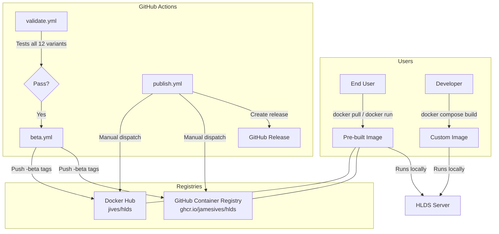

## Docker Build Process 📦

The `Dockerfile` in `container/` uses a single-stage build on Ubuntu. SteamCMD downloads the requested game files during the image build.

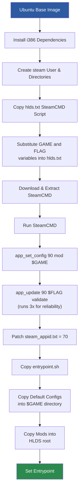

## Container Runtime Flow ▶️

When the container starts, `entrypoint.sh` runs before the HLDS server binary. It first checks whether a `+map` argument was provided (warning the user if not, as the server won't be joinable without one). It then syncs any user-provided mods and config files from their temporary volume mount locations into the correct HLDS directories using `rsync`. Finally, it prints a branded startup banner and launches `hlds_run`.

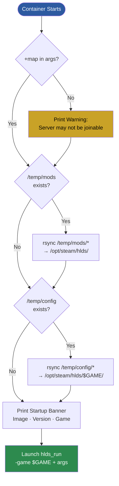

## Volume Mapping Architecture 💾

Users provide custom configurations and mods by placing files in `./config/` and `./mods/` on the host. These directories are volume-mounted into temporary locations inside the container (`/temp/config` and `/temp/mods`). On startup, the entrypoint script uses `rsync` to copy them into the correct HLDS directories — configs go into the game-specific folder (`/opt/steam/hlds/$GAME/`) and mods go into the HLDS root (`/opt/steam/hlds/`). This two-step approach ensures files are synced with correct ownership and directory structure, even when overwriting existing files from the base image.

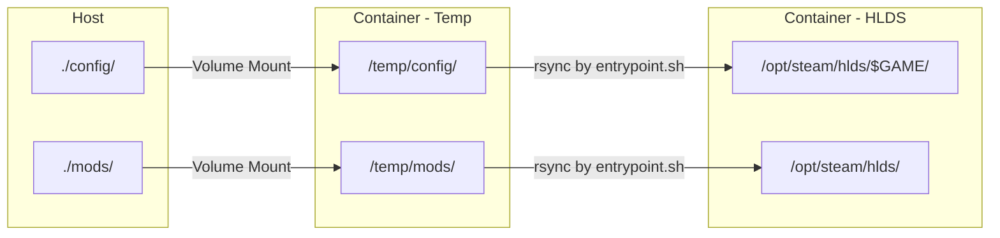

### Config Sync Example

```
Host: ./config/                    Container: /opt/steam/hlds/cstrike/
├── mapcycle.txt          ──→      ├── mapcycle.txt
├── motd.txt              ──→      ├── motd.txt
├── maps/                          ├── maps/
│   └── crazytank.bsp     ──→     │   └── crazytank.bsp
└── addons/                        └── addons/
    └── amxmodx/           ──→         └── amxmodx/
```

### Mods Sync Example

```
Host: ./mods/                      Container: /opt/steam/hlds/
├── decay/                ──→      ├── decay/
│   ├── autoexec.cfg               │   ├── autoexec.cfg
│   ├── models/                    │   ├── models/
│   └── maps/                      │   └── maps/
└── svencoop/             ──→      └── svencoop/
```

## CI/CD Pipeline 🔄

The project uses a three-branch workflow. Feature branches trigger validation only. The `beta` branch triggers beta image publishing for testing. Production releases are triggered manually via `workflow_dispatch` on `publish.yml`, which bumps the version, builds and validates all 12 game variants, pushes to both registries, and creates a GitHub Release.

### Branch Strategy

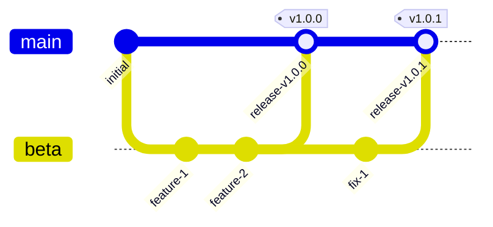

### Workflow Triggers

Each workflow is triggered by a specific event. Feature branch pushes run validation, beta branch pushes build and publish beta images, production releases are manually dispatched, pull requests get auto-labeled, and sponsor data is refreshed on a daily cron schedule.

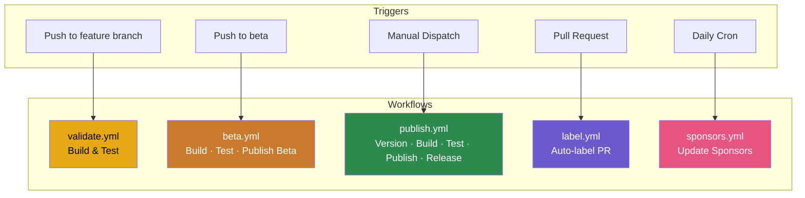

### Production Publish Pipeline Detail

The production publish workflow is the most complex pipeline. It starts with a version bump, then builds each of the 12 game variants in parallel. For each variant, it strips the `-legacy` suffix from the game name (if present) and sets the appropriate SteamCMD beta flag. After building, it runs the container with test configurations to validate that volume mappings and game data are correct before pushing to both Docker Hub and GitHub Container Registry. Only after all builds pass does it create the Git tag and GitHub Release.

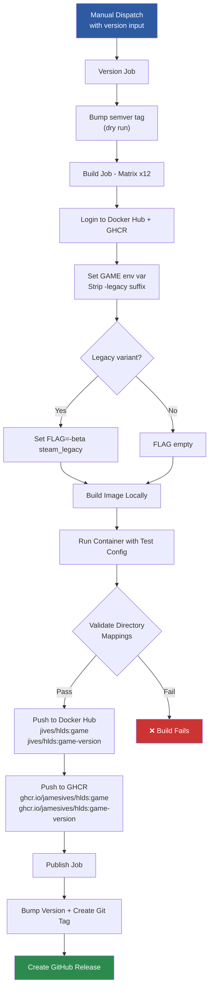

## Validation Test Matrix ✅

The validation workflow runs against all 12 supported game variants in parallel (8 modern + 4 legacy). For each variant, it builds the Docker image, creates mock config and mod files, starts the container, then validates that mods sync to the HLDS root, configs sync to the game directory, and the correct game data is present. This ensures that volume mapping and the entrypoint sync logic work correctly for every supported game.

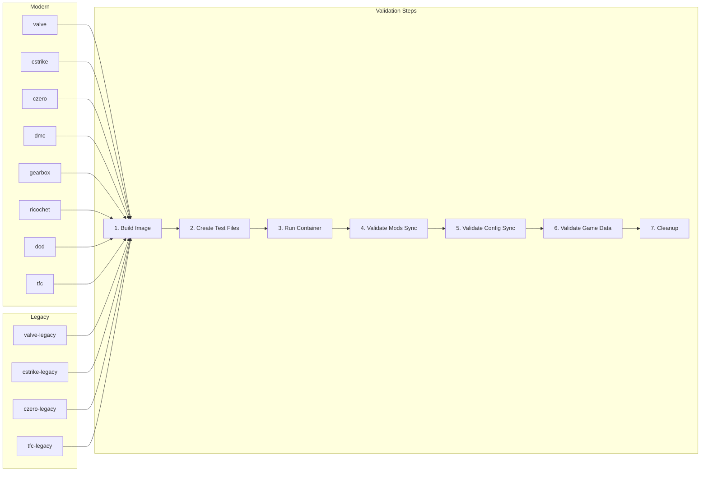

## Container File System Layout 📂

Inside the container, all HLDS files live under `/opt/steam/hlds/`. The `valve/` directory is always present as the base game. The active game directory (`$GAME/`) contains the server configuration files (`server.cfg`, `autoexec.cfg`, `default.cfg`, `motd.txt`), maps, and any user-installed addons. The `steam_appid.txt` file is patched to contain `70` (Half-Life's app ID) to work around a known Steam client issue. Custom mods synced from `/temp/mods` appear as sibling directories alongside the built-in game folders.

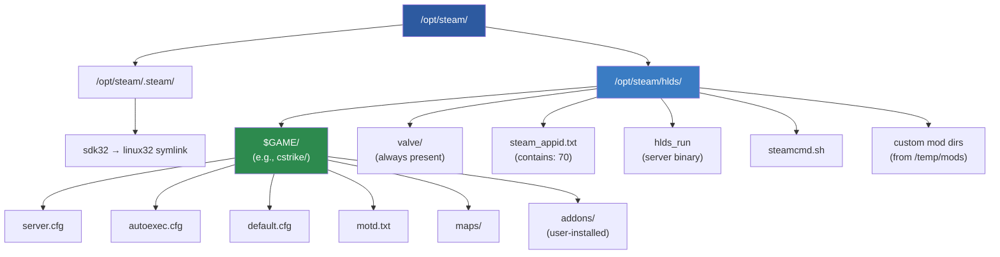

## Network Architecture 🌐

The HLDS container exposes two ports. Port `27015` handles both game traffic (UDP) and RCON remote administration (TCP). Port `26900` (UDP) is used to communicate with the Steam master server, which registers the server in the public server browser so players can discover and join it.

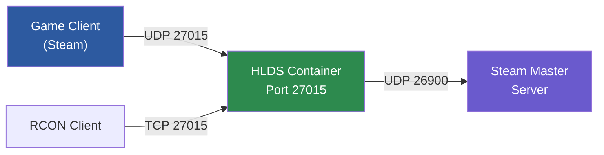

## SteamCMD Install Script ⚙️

The `hlds.txt` script drives SteamCMD during the Docker build. It logs in anonymously, configures app ID `90` (Half-Life) with the requested game mod, then runs `app_update` three times with the `validate` flag. The triple-run is intentional — SteamCMD downloads can be unreliable, and running the update multiple times ensures all files are fully downloaded even on flaky connections. `@ShutdownOnFailedCommand 0` prevents SteamCMD from aborting on transient errors.

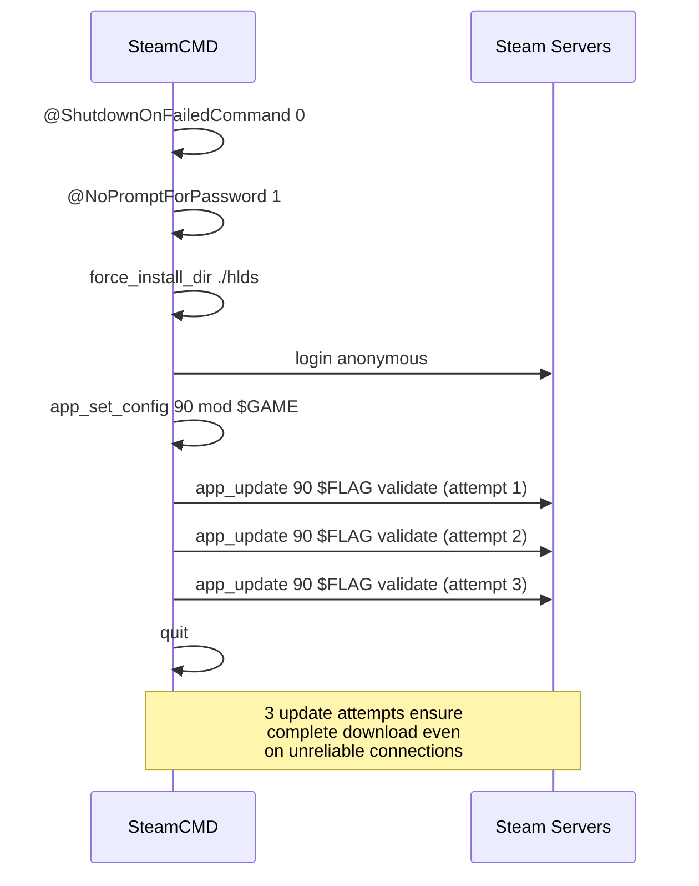

## User Interaction Paths 🧑‍💻

There are two main ways to use the project. End users pull a pre-built image from a registry and run it directly with `docker run` or `docker compose up`. Developers who want to customize the build clone the repository, set the `GAME` environment variable, and build from the `container/` directory. Both paths converge at runtime, where users can optionally add custom configs and mods via volume mounts before connecting to the server through Steam.

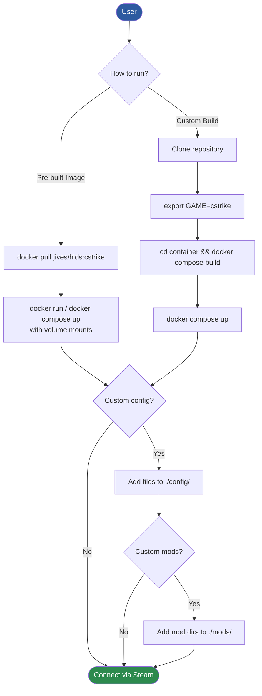
