# Architecture

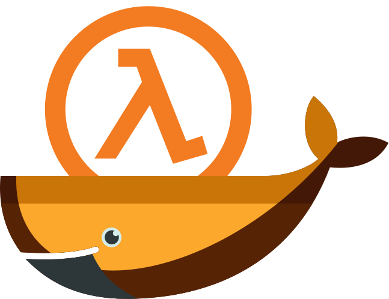

This document describes the architecture of the hlds-docker project using diagrams to illustrate the build process, runtime behavior, CI/CD pipeline, and file system layout.

## High-Level Overview 🌍

The project has two primary user paths: end users pull pre-built images from Docker Hub or GitHub Container Registry, while developers clone the repository and build custom images locally. Both paths result in a running HLDS container. GitHub Actions workflows handle validation, beta publishing, and production releases across all 12 supported game variants.

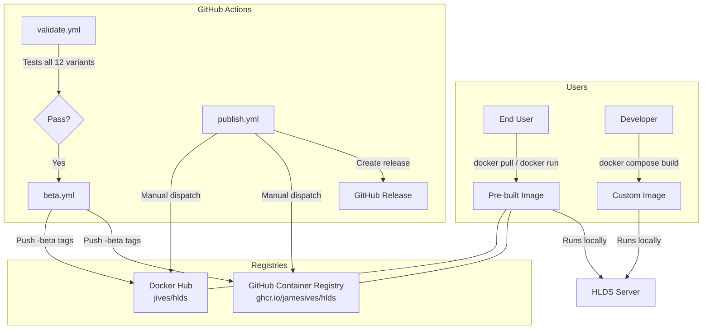
```mermaid
graph TB
    subgraph Users
        A[End User] -->|docker pull / docker run| D[Pre-built Image]
        B[Developer] -->|docker compose build| E[Custom Image]
    end

    subgraph Registries
        D --- DH[Docker Hub<br>jives/hlds]
        D --- GH[GitHub Container Registry<br>ghcr.io/jamesives/hlds]
    end

    subgraph GitHub Actions
        CI[validate.yml] -->|Tests all 12 variants| V{Pass?}
        V -->|Yes| BETA[beta.yml]
        BETA -->|Push -beta tags| DH
        BETA -->|Push -beta tags| GH
        PROD[publish.yml] -->|Manual dispatch| DH
        PROD -->|Manual dispatch| GH
        PROD -->|Create release| REL[GitHub Release]
    end

    E -->|Runs locally| SRV[HLDS Server]
    D -->|Runs locally| SRV
```

## Docker Build Process 📦

The `Dockerfile` in `container/` uses a single-stage build on Ubuntu. SteamCMD downloads the requested game files during the image build.

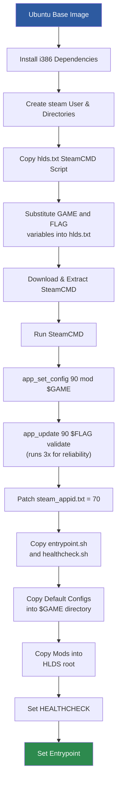
```mermaid
flowchart TD
    A[Ubuntu Base Image] --> B[Install i386 Dependencies]
    B --> C[Create steam User & Directories]
    C --> D[Copy hlds.txt SteamCMD Script]
    D --> E[Substitute GAME and FLAG<br>variables into hlds.txt]
    E --> F[Download & Extract SteamCMD]
    F --> G[Run SteamCMD]
    G --> H["app_set_config 90 mod $GAME"]
    H --> I["app_update 90 $FLAG validate<br>(runs 3x for reliability)"]
    I --> J[Patch steam_appid.txt = 70]
    J --> K[Copy entrypoint.sh<br>and healthcheck.sh]
    K --> L[Copy Default Configs<br>into $GAME directory]
    L --> M[Copy Mods into<br>HLDS root]
    M --> HC[Set HEALTHCHECK]
    HC --> N[Set Entrypoint]

    style A fill:#2d5aa0,color:#fff
    style N fill:#2d8a4e,color:#fff
```

## Container Runtime Flow ▶️

When the container starts, `entrypoint.sh` runs before the HLDS server binary. It first checks whether a `+map` argument was provided (warning the user if not, as the server won't be joinable without one). If `AUTO_UPDATE` is set, it re-runs SteamCMD against the persisted install directory to pick up any Valve patches before proceeding. It then syncs any user-provided mods and config files from their temporary volume mount locations into the correct HLDS directories using `rsync` - after the update, so user files still win if it restores a default. Finally, it prints a branded startup banner and launches `hlds_run`. Independently of this flow, Docker periodically runs `healthcheck.sh` against the live server - see the Health Check Flow section below.

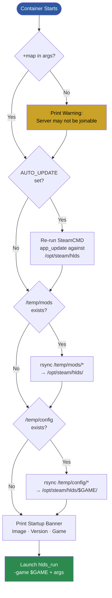
```mermaid
flowchart TD
    START([Container Starts]) --> CHECK{"+map" in args?}
    CHECK -->|No| WARN[Print Warning:<br>Server may not be joinable]
    CHECK -->|Yes| UPDATE
    WARN --> UPDATE

    UPDATE{"AUTO_UPDATE<br>set?"} -->|Yes| STEAMCMD["Re-run SteamCMD<br>app_update against<br>/opt/steam/hlds"]
    UPDATE -->|No| MODS
    STEAMCMD --> MODS

    MODS{"/temp/mods<br>exists?"} -->|Yes| SYNC_MODS["rsync /temp/mods/*<br>→ /opt/steam/hlds/"]
    MODS -->|No| CFG
    SYNC_MODS --> CFG

    CFG{"/temp/config<br>exists?"} -->|Yes| SYNC_CFG["rsync /temp/config/*<br>→ /opt/steam/hlds/$GAME/"]
    CFG -->|No| BANNER
    SYNC_CFG --> BANNER

    BANNER[Print Startup Banner<br>Image · Version · Game] --> LAUNCH

    LAUNCH["Launch hlds_run<br>-game $GAME + args"]

    style START fill:#2d5aa0,color:#fff
    style LAUNCH fill:#2d8a4e,color:#fff
    style WARN fill:#c9a227,color:#000
```

## Health Check Flow 🩺

Independently of `entrypoint.sh`, the Docker daemon runs `healthcheck.sh` on a fixed schedule (every 30s, 5s timeout, 60s start period, 3 retries) for as long as the container is running. The script sends a raw `A2S_INFO` query over UDP to `127.0.0.1:$PORT` (default `27015`) using bash's built-in `/dev/udp` - no extra dependencies - and succeeds only if the response starts with the expected `0xFFFFFFFF` header.

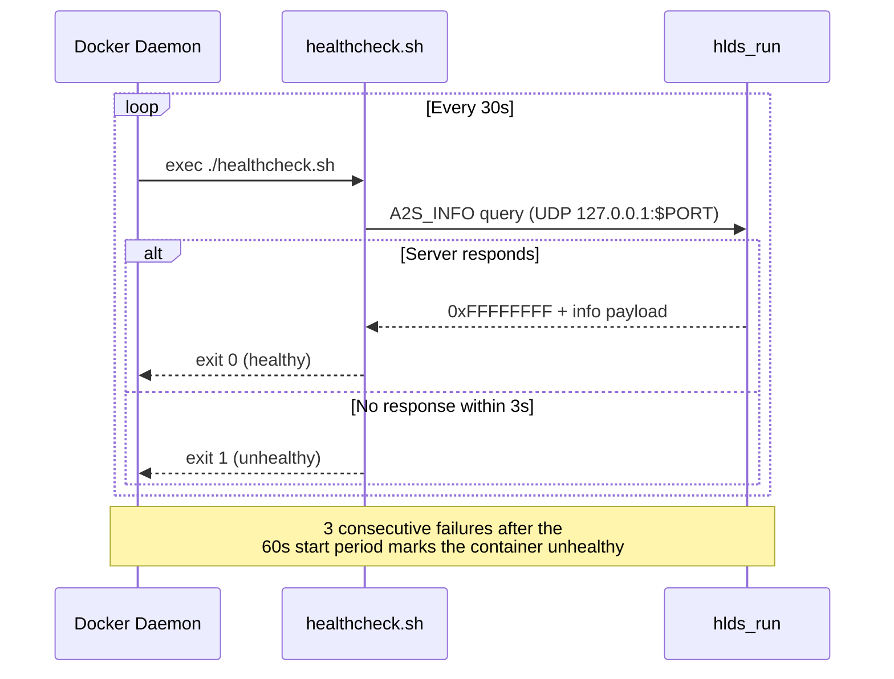
```mermaid
sequenceDiagram
    participant Docker as Docker Daemon
    participant HC as healthcheck.sh
    participant HLDS as hlds_run

    loop Every 30s
        Docker->>HC: exec ./healthcheck.sh
        HC->>HLDS: A2S_INFO query (UDP 127.0.0.1:$PORT)
        alt Server responds
            HLDS-->>HC: 0xFFFFFFFF + info payload
            HC-->>Docker: exit 0 (healthy)
        else No response within 3s
            HC-->>Docker: exit 1 (unhealthy)
        end
    end

    Note over Docker,HLDS: 3 consecutive failures after the<br>60s start period marks the container unhealthy
```

## Volume Mapping Architecture 💾

Users provide custom configurations and mods by placing files in `./config/` and `./mods/` on the host. These directories are volume-mounted into temporary locations inside the container (`/temp/config` and `/temp/mods`). On startup, the entrypoint script uses `rsync` to copy them into the correct HLDS directories: configs go into the game-specific folder (`/opt/steam/hlds/$GAME/`) and mods go into the HLDS root (`/opt/steam/hlds/`). This two-step approach ensures files are synced with correct ownership and directory structure, even when overwriting existing files from the base image.

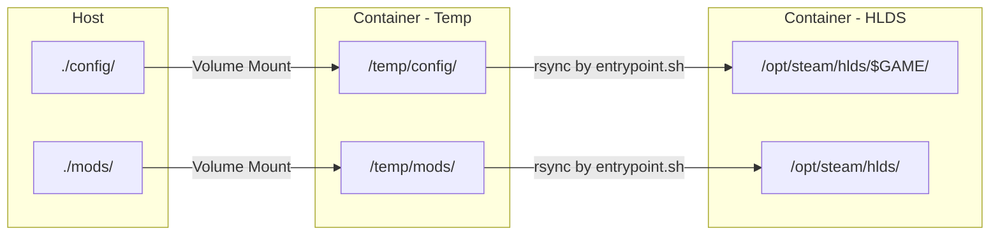
```mermaid
flowchart LR
    subgraph Host
        HC["./config/"]
        HM["./mods/"]
    end

    subgraph Container - Temp
        TC["/temp/config/"]
        TM["/temp/mods/"]
    end

    subgraph Container - HLDS
        GD["/opt/steam/hlds/$GAME/"]
        HR["/opt/steam/hlds/"]
    end

    HC -->|"Volume Mount"| TC
    HM -->|"Volume Mount"| TM
    TC -->|"rsync by entrypoint.sh"| GD
    TM -->|"rsync by entrypoint.sh"| HR
```

### Config Sync Example

```
Host: ./config/                    Container: /opt/steam/hlds/cstrike/
├── mapcycle.txt          ──→      ├── mapcycle.txt
├── motd.txt              ──→      ├── motd.txt
├── maps/                          ├── maps/
│   └── crazytank.bsp     ──→     │   └── crazytank.bsp
└── addons/                        └── addons/
    └── amxmodx/           ──→         └── amxmodx/
```

### Mods Sync Example

```
Host: ./mods/                      Container: /opt/steam/hlds/
├── decay/                ──→      ├── decay/
│   ├── autoexec.cfg               │   ├── autoexec.cfg
│   ├── models/                    │   ├── models/
│   └── maps/                      │   └── maps/
└── svencoop/             ──→      └── svencoop/
```

## CI/CD Pipeline 🔄

The project uses a three-branch workflow. Feature branches trigger validation only. The `beta` branch triggers beta image publishing for testing. Production releases happen two ways on `publish.yml`: manually via `workflow_dispatch`, which merges `beta` into `main`, bumps the version, builds and validates all 12 game variants, pushes to both registries, and creates a GitHub Release; or automatically on a weekly `schedule`, which skips the `beta` merge entirely and just rebuilds `main`'s already-released code against the current Steam depot, so published images don't go stale between manual releases without ever auto-promoting unreviewed code.

### Branch Strategy

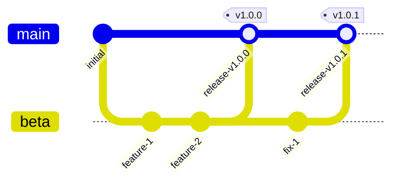
```mermaid
gitGraph
    commit id: "initial"
    branch beta
    commit id: "feature-1"
    commit id: "feature-2"
    checkout main
    merge beta id: "release-v1.0.0" tag: "v1.0.0"
    checkout beta
    commit id: "fix-1"
    checkout main
    merge beta id: "release-v1.0.1" tag: "v1.0.1"
```

### Workflow Triggers

Each workflow is triggered by a specific event. Feature branch pushes run validation, beta branch pushes build and publish beta images, production releases are dispatched manually or fire weekly on a cron schedule, pull requests get auto-labeled, and sponsor data is refreshed on a daily cron schedule.

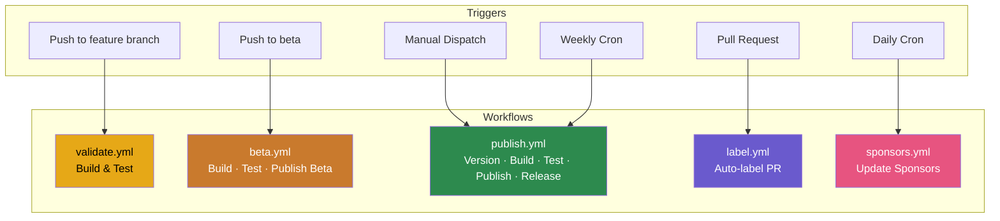
```mermaid
flowchart TD
    subgraph Triggers
        PUSH_FEAT["Push to feature branch"]
        PUSH_BETA["Push to beta"]
        DISPATCH["Manual Dispatch"]
        WEEKLY["Weekly Cron"]
        PR["Pull Request"]
        CRON["Daily Cron"]
    end

    subgraph Workflows
        VAL["validate.yml<br>Build & Test"]
        BETA_WF["beta.yml<br>Build · Test · Publish Beta"]
        PUB["publish.yml<br>Version · Build · Test · Publish · Release"]
        LABEL["label.yml<br>Auto-label PR"]
        SPONSOR["sponsors.yml<br>Update Sponsors"]
    end

    PUSH_FEAT --> VAL
    PUSH_BETA --> BETA_WF
    DISPATCH --> PUB
    WEEKLY --> PUB
    PR --> LABEL
    CRON --> SPONSOR

    style VAL fill:#e6a817,color:#000
    style BETA_WF fill:#c97a2d,color:#fff
    style PUB fill:#2d8a4e,color:#fff
    style LABEL fill:#6a5acd,color:#fff
    style SPONSOR fill:#e75480,color:#fff
```

### Production Publish Pipeline Detail

The production publish workflow can start two ways: manually via `workflow_dispatch` with a `bump` choice (patch/minor/major), or automatically every week via `schedule`. The scheduled path runs one extra gate first: it queries Steam's `app_info` for HLDS's `public` and `steam_legacy` branch update timestamps and compares them against the last release's publish time, stopping immediately (no version bump, no build, no new tags) if nothing changed - GoldSrc games are rarely patched, so most weekly ticks are expected to stop here rather than publish 12 near-duplicate tags for nothing. A manual dispatch always skips this check and proceeds, since a human explicitly asking for a release is reason enough. Both paths that do proceed compute the next version and run the same 12-variant test matrix (build, Trivy scan, and the shared smoke test action) before anything is pushed. The manual path first merges `beta` into a scratch `release-candidate` ref and, once tests pass, fast-forwards `main` to it - promoting new code. The scheduled path skips that merge entirely: it tests and rebuilds `main`'s already-released code as-is, so a fresh SteamCMD download against the current Steam depot is the only thing that changes. Once tests pass, both paths build and push all 12 variants to Docker Hub and GHCR, attest provenance, and create a GitHub Release.

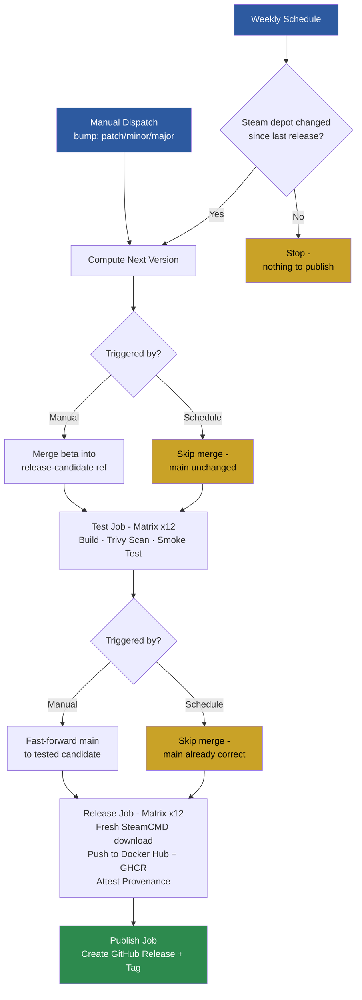
```mermaid
flowchart TD
    A[Manual Dispatch<br>bump: patch/minor/major] --> V[Compute Next Version]
    B[Weekly Schedule] --> CHECK{Steam depot changed<br>since last release?}
    CHECK -->|No| STOP[Stop -<br>nothing to publish]
    CHECK -->|Yes| V

    V --> BRANCH{Triggered by?}
    BRANCH -->|Manual| PREP["Merge beta into<br>release-candidate ref"]
    BRANCH -->|Schedule| SKIP1["Skip merge -<br>main unchanged"]

    PREP --> TEST
    SKIP1 --> TEST

    TEST["Test Job - Matrix x12<br>Build · Trivy Scan · Smoke Test"]

    TEST --> BRANCH2{Triggered by?}
    BRANCH2 -->|Manual| MERGE["Fast-forward main<br>to tested candidate"]
    BRANCH2 -->|Schedule| SKIP2["Skip merge -<br>main already correct"]

    MERGE --> RELEASE
    SKIP2 --> RELEASE

    RELEASE["Release Job - Matrix x12<br>Fresh SteamCMD download<br>Push to Docker Hub + GHCR<br>Attest Provenance"]

    RELEASE --> PUBLISH[Publish Job<br>Create GitHub Release + Tag]

    style A fill:#2d5aa0,color:#fff
    style B fill:#2d5aa0,color:#fff
    style PUBLISH fill:#2d8a4e,color:#fff
    style SKIP1 fill:#c9a227,color:#000
    style SKIP2 fill:#c9a227,color:#000
    style STOP fill:#c9a227,color:#000
```

## Validation Test Matrix ✅

The validation workflow runs against all 12 supported game variants in parallel (8 modern + 4 legacy). For each variant, it builds the Docker image, creates mock config and mod files, starts the container, then validates that mods sync to the HLDS root, configs sync to the game directory, and the correct game data is present. This ensures that volume mapping and the entrypoint sync logic work correctly for every supported game.

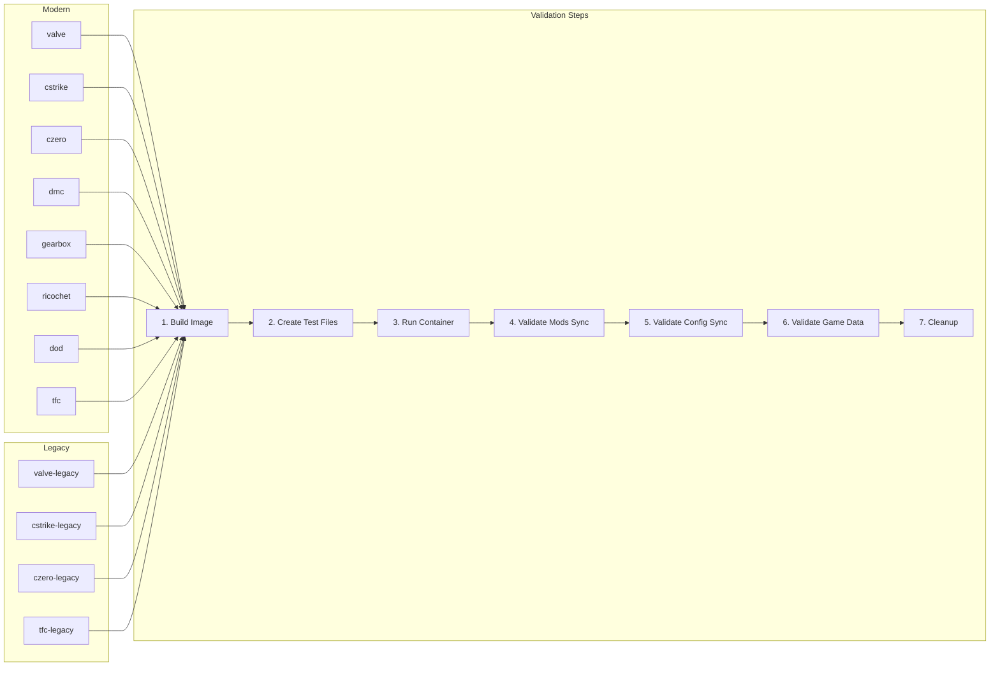
```mermaid
flowchart LR
    subgraph Modern
        V[valve]
        CS[cstrike]
        CZ[czero]
        DMC[dmc]
        GB[gearbox]
        RC[ricochet]
        DOD[dod]
        TFC[tfc]
    end

    subgraph Legacy
        VL[valve-legacy]
        CSL[cstrike-legacy]
        CZL[czero-legacy]
        TFCL[tfc-legacy]
    end

    subgraph Validation Steps
        S1["1. Build Image"]
        S2["2. Create Test Files"]
        S3["3. Run Container"]
        S4["4. Validate Mods Sync"]
        S5["5. Validate Config Sync"]
        S6["6. Validate Game Data"]
        S7["7. Cleanup"]
    end

    V & CS & CZ & DMC & GB & RC & DOD & TFC & VL & CSL & CZL & TFCL --> S1
    S1 --> S2 --> S3 --> S4 --> S5 --> S6 --> S7
```

## Container File System Layout 📂

Inside the container, all HLDS files live under `/opt/steam/hlds/`. The `valve/` directory is always present as the base game. The active game directory (`$GAME/`) contains the server configuration files (`server.cfg`, `autoexec.cfg`, `default.cfg`, `motd.txt`), maps, and any user-installed addons. The `steam_appid.txt` file is patched to contain `70` (Half-Life's app ID) to work around a known Steam client issue. Custom mods synced from `/temp/mods` appear as sibling directories alongside the built-in game folders.

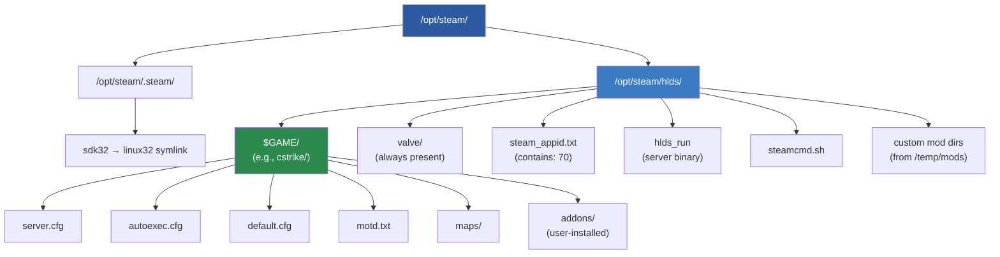
```mermaid
flowchart TD
    ROOT["/opt/steam/"] --> HLDS["/opt/steam/hlds/"]
    ROOT --> STEAM["/opt/steam/.steam/"]
    STEAM --> SDK["sdk32 → linux32 symlink"]

    HLDS --> GAME_DIR["$GAME/<br>(e.g., cstrike/)"]
    HLDS --> VALVE["valve/<br>(always present)"]
    HLDS --> APPID["steam_appid.txt<br>(contains: 70)"]
    HLDS --> HLDS_RUN["hlds_run<br>(server binary)"]
    HLDS --> CMD["steamcmd.sh"]
    HLDS --> CUSTOM_MOD["custom mod dirs<br>(from /temp/mods)"]

    GAME_DIR --> CFG["server.cfg"]
    GAME_DIR --> AUTO["autoexec.cfg"]
    GAME_DIR --> DEF["default.cfg"]
    GAME_DIR --> MOTD["motd.txt"]
    GAME_DIR --> MAPS["maps/"]
    GAME_DIR --> PLUGINS["addons/<br>(user-installed)"]

    style ROOT fill:#2d5aa0,color:#fff
    style HLDS fill:#3a7cc3,color:#fff
    style GAME_DIR fill:#2d8a4e,color:#fff
```

## Network Architecture 🌐

The HLDS container exposes two ports. Port `27015` handles both game traffic (UDP) and RCON remote administration (TCP). Port `26900` (UDP) is used to communicate with the Steam master server, which registers the server in the public server browser so players can discover and join it.

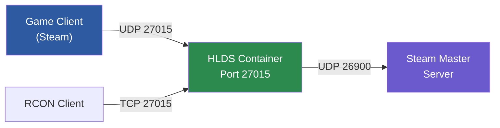
```mermaid
flowchart LR
    PLAYER["Game Client<br>(Steam)"] -->|"UDP 27015"| SERVER["HLDS Container<br>Port 27015"]
    RCON["RCON Client"] -->|"TCP 27015"| SERVER
    SERVER -->|"UDP 26900"| MASTER["Steam Master<br>Server"]

    style PLAYER fill:#2d5aa0,color:#fff
    style SERVER fill:#2d8a4e,color:#fff
    style MASTER fill:#6a5acd,color:#fff
```

## SteamCMD Install Script ⚙️

The `hlds.txt` script drives SteamCMD during the Docker build. It logs in anonymously, configures app ID `90` (Half-Life) with the requested game mod, then runs `app_update` three times with the `validate` flag. The triple-run is intentional: SteamCMD downloads can be unreliable, and running the update multiple times ensures all files are fully downloaded even on flaky connections. `@ShutdownOnFailedCommand 0` prevents SteamCMD from aborting on transient errors.

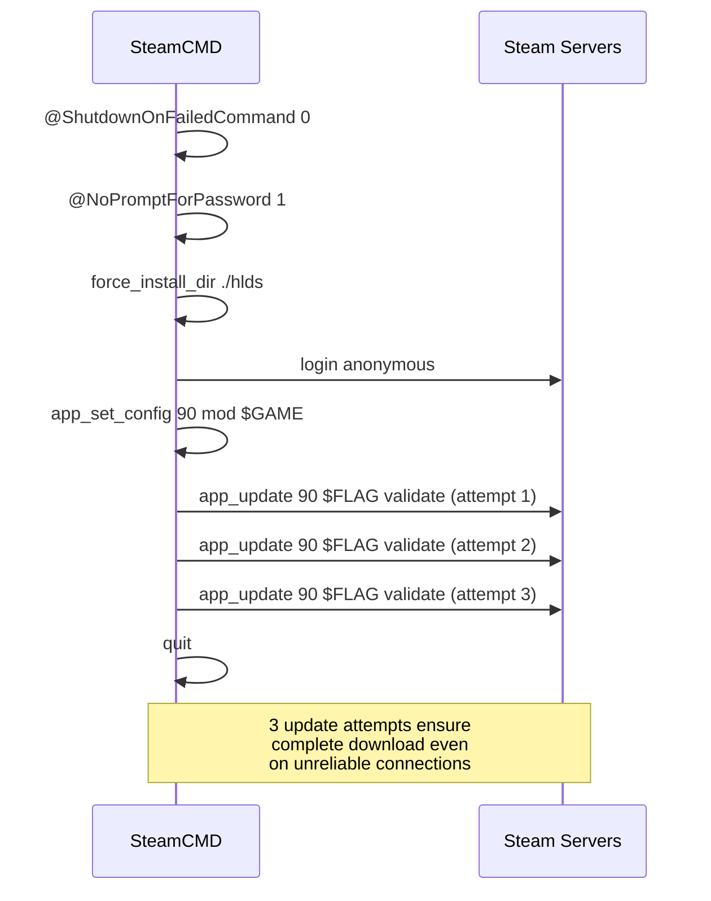
```mermaid
sequenceDiagram
    participant SC as SteamCMD
    participant Steam as Steam Servers

    SC->>SC: @ShutdownOnFailedCommand 0
    SC->>SC: @NoPromptForPassword 1
    SC->>SC: force_install_dir ./hlds
    SC->>Steam: login anonymous
    SC->>SC: app_set_config 90 mod $GAME
    SC->>Steam: app_update 90 $FLAG validate (attempt 1)
    SC->>Steam: app_update 90 $FLAG validate (attempt 2)
    SC->>Steam: app_update 90 $FLAG validate (attempt 3)
    SC->>SC: quit

    Note over SC,Steam: 3 update attempts ensure<br>complete download even<br>on unreliable connections
```

## User Interaction Paths 🧑‍💻

There are two main ways to use the project. End users pull a pre-built image from a registry and run it directly with `docker run` or `docker compose up`. Developers who want to customize the build clone the repository, set the `GAME` environment variable, and build from the `container/` directory. Both paths converge at runtime, where users can optionally add custom configs and mods via volume mounts before connecting to the server through Steam.

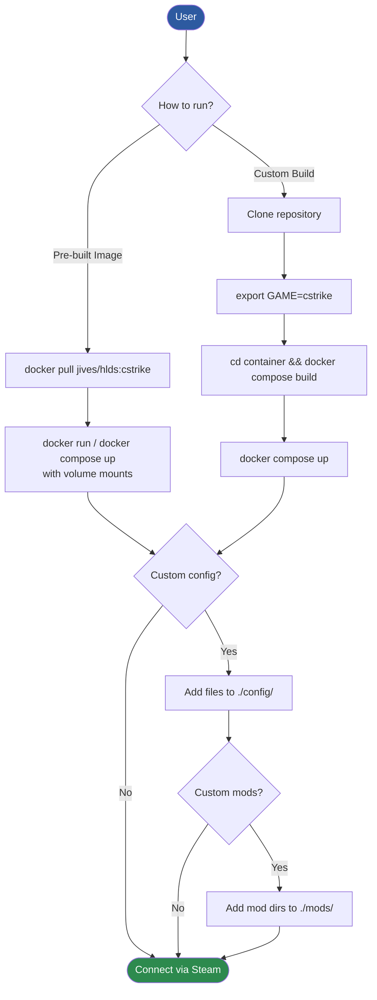
```mermaid
flowchart TD
    USER([User]) --> CHOICE{How to run?}

    CHOICE -->|Pre-built Image| PULL["docker pull jives/hlds:cstrike"]
    CHOICE -->|Custom Build| CLONE["Clone repository"]

    PULL --> RUN_PRE["docker run / docker compose up<br>with volume mounts"]
    CLONE --> SET_GAME["export GAME=cstrike"]
    SET_GAME --> BUILD["cd container && docker compose build"]
    BUILD --> RUN_CUSTOM["docker compose up"]

    RUN_PRE --> CONFIG{Custom config?}
    RUN_CUSTOM --> CONFIG

    CONFIG -->|Yes| ADD_CFG["Add files to ./config/"]
    CONFIG -->|No| PLAY

    ADD_CFG --> MODS{Custom mods?}
    MODS -->|Yes| ADD_MODS["Add mod dirs to ./mods/"]
    MODS -->|No| PLAY

    ADD_MODS --> PLAY([Connect via Steam])

    style USER fill:#2d5aa0,color:#fff
    style PLAY fill:#2d8a4e,color:#fff
```
