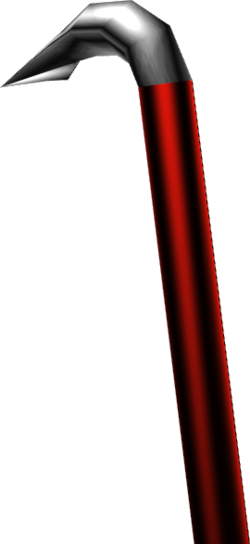

# Half-Life Dedicated Server With Docker 🐋 📦



Creates a [Half-Life Dedicated Server](https://help.steampowered.com/en/faqs/view/081A-106F-B906-1A7A) instance using [Docker](https://www.docker.com). You can run any games the Half-Life Dedicated Server client supports out of the box, including the ability to add custom configurations, mods and plugins.

## Setup ⚙️

Before starting, ensure you have the [Docker daemon](https://www.docker.com/) and the [Docker CLI tool](https://docs.docker.com/engine/reference/commandline/cli/) installed and available.

> [!IMPORTANT]  
> The following steps will not work if you use an ARM architecture system. For best results, use a system running x86-64.

### Pre-Built Images

If you're just looking to start a server as quickly as possible you can follow these steps to use a pre-built image on [Docker Hub](https://hub.docker.com/repository/docker/jives/hlds) or the [GitHub Container Registry](https://github.com/JamesIves/hlds-docker/pkgs/container/hlds).

1. Create a `docker-compose.yml` file by copying and pasting the example below. Adjust the `image` property so the tag name corresponds with the game you want to use. Additionally you can adjust the server startup arguments by modifying the `command` property; [for a list of available arguments, visit the Valve Developer Wiki](https://developer.valvesoftware.com/wiki/Half-Life_Dedicated_Server).

> [!NOTE]  
> In the majority of cases you'll need to specify `+map` for the server to be joinable.

```yml
services:
  hlds:
    build: docker
    # 📣 Adjust the image value here with the desired game you want the server to use.
    image: jives/hlds:cstrike
    volumes:
      - "./config:/temp/config"
      - "./mods:/temp/mods"
    ports:
      - "27015:27015/udp"
      - "27015:27015"
      - "26900:2690/udp"
    environment:
      - GAME=${GAME}
    # 📣 Modify your server startup commands here.
    # 📣 Remember: Stating map is based on the game, and will likely be different between images.
    command: +maxplayers 12 +map cs_italy
```

> [!TIP]  
> Available images include:
>
> - `jives/hlds:valve` ([Half-Life Deathmatch](https://store.steampowered.com/app/70/HalfLife/))
> - `jives/hlds:cstrike` ([Counter-Strike](https://store.steampowered.com/app/10/CounterStrike/))
> - `jives/hlds:czero` ([Counter-Strike Condition Zero](https://store.steampowered.com/app/80/CounterStrike_Condition_Zero/))
> - `jives/hlds:dmc` ([Deathmatch Classic](https://store.steampowered.com/app/40/Deathmatch_Classic/))
> - `jives/hlds:gearbox` ([Half-Life Opposing Force](https://store.steampowered.com/app/50/HalfLife_Opposing_Force/))
> - `jives/hlds:ricohet` ([Ricochet](https://store.steampowered.com/app/60/Ricochet/))
> - `jives/hlds:dod` ([Day of Defeat](https://store.steampowered.com/app/30/Day_of_Defeat/))
> - `jives/hlds:tfc` ([Team Fortress Classic](https://store.steampowered.com/app/20/Team_Fortress_Classic/))

2. Start the image. Once the Half-Life Dedicated Server client starts, you'll receive a stream of messages, including the server's public IP address and any startup errors.

```bash
docker compose up
```

3. Connect to your server via the IP address by loading the game on [Steam](https://store.steampowered.com/) and start playing. You must own a copy of the game on Steam in order to play. ⌨️

### Building an Image

1. Clone this project.
2. Define the game you want the server to run. You can do this by setting an environment variable on your command line.

```bash
export GAME=cstrike
```

Before continuing to the next steps, verify that the environment variable is set by running `echo $GAME` in your terminal. It should send back the variable you just set.

> [!TIP]
> Available options include:
>
> - `valve` ([Half-Life Deathmatch](https://store.steampowered.com/app/70/HalfLife/))
> - `cstrike` ([Counter-Strike](https://store.steampowered.com/app/10/CounterStrike/))
> - `czero` ([Counter-Strike Condition Zero](https://store.steampowered.com/app/80/CounterStrike_Condition_Zero/))
> - `dmc` ([Deathmatch Classic](https://store.steampowered.com/app/40/Deathmatch_Classic/))
> - `gearbox` ([Half-Life Opposing Force](https://store.steampowered.com/app/50/HalfLife_Opposing_Force/))
> - `ricohet` ([Ricochet](https://store.steampowered.com/app/60/Ricochet/))
> - `dod` ([Day of Defeat](https://store.steampowered.com/app/30/Day_of_Defeat/))
> - `tfc` ([Team Fortress Classic](https://store.steampowered.com/app/20/Team_Fortress_Classic/))

3. Build the image.

```sh
docker compose build
```

4. If you want to modify the server startup arguments, you can provide a `command` property within `docker-compose.yml`; [for a list of available arguments, visit the Valve Developer Wiki](https://developer.valvesoftware.com/wiki/Half-Life_Dedicated_Server).

> [!NOTE]  
> In the majority of cases you'll need to specify `+map` for the server to be joinable.

```yml
services:
  hlds:
    command: +maxplayers 16 +map cs_italy
```

5. Start the image. Once the Half-Life Dedicated Server client starts, you'll receive a stream of messages, including the server's public IP address and any startup errors.

```bash
docker compose up
```

6. Connect to your server via the IP address by loading the game on [Steam](https://store.steampowered.com/) and start playing. You must own a copy of the game on Steam in order to play. ⌨️

## Server Configuration 🔧

### Configs and Plugins

If you wish to add server configurations, such as add-ons, plugins, map rotations, etc, you can add them to the `config` directory. Any configuration files will be copied into the container on start and placed within the folder for the specified game. For example, if you set the game as `cstrike`, the contents of the config folder will be placed within the `cstrike` directory on the server.

### Custom Mods

If you want to run a custom mod, you can do so with the `mods` directory. Similar to the `config` directory, this folder will be copied into your container on start alongside the other game folders.

1. Add your mod files as a sub-directory of `mods`. For example if the mod name is `decay`, you'd place it in `mods/decay`.
2. Define the `GAME` environment variable so it points to your mod name. This works if you're using a pre-built image `docker-compose.yml` or by building one yourself.

```bash
export GAME=decay
```

3. Build the image. If you don't want to build the image, I suggest using the pre-built `jives/hlds:valve` image.

```bash
docker compose build
```

4. Start the image. Most Half-Life mods require _specific_ startup arguments, refer to the [Valve Developer Wiki](https://developer.valvesoftware.com/wiki/Half-Life_Dedicated_Server) and the instructions for the mod you're trying to run for more details. You can find details about how to add these above.

```bash
docker compose up
```

## Ownership 🧰

The Half-Life Dedicated Server client, Steam, SteamCMD and the titles themselves are property and ownership of [Valve Software](https://valvesoftware.com). All this software does is make it easier to interface with their provided tooling.
