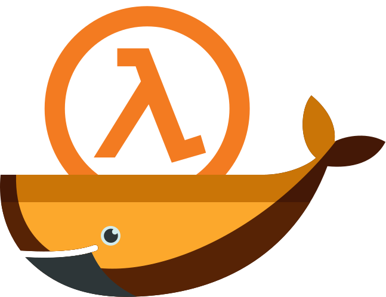

# hlds-docker



[Half-Life Dedicated Server](https://help.steampowered.com/en/faqs/view/081A-106F-B906-1A7A) powered by [Docker](https://www.docker.com). It supports all the classic [GoldSrc](https://developer.valvesoftware.com/wiki/GoldSrc) Half-Life games and mods, including the ability to add custom configurations and plugins.

Special thank you to all the past and present [GitHub Sponsors](https://github.com/sponsors/JamesIves) 💖.

<!-- sponsors --><a href="https://github.com/Chooksta69"></a>&nbsp;&nbsp;<a href="https://github.com/MattWillFlood"></a>&nbsp;&nbsp;<a href="https://github.com/jonathan-milan-pollock"></a>&nbsp;&nbsp;<a href="https://github.com/raoulvdberge"></a>&nbsp;&nbsp;<a href="https://github.com/robjtede"></a>&nbsp;&nbsp;<a href="https://github.com/hadley"></a>&nbsp;&nbsp;<a href="https://github.com/kevinchalet"></a>&nbsp;&nbsp;<a href="https://github.com/Yousazoe"></a>&nbsp;&nbsp;<a href="https://github.com/github"></a>&nbsp;&nbsp;<a href="https://github.com/annegentle"></a>&nbsp;&nbsp;<a href="https://github.com/planetoftheweb"></a>&nbsp;&nbsp;<a href="https://github.com/melton1968"></a>&nbsp;&nbsp;<a href="https://github.com/szepeviktor"></a>&nbsp;&nbsp;<a href="https://github.com/sckott"></a>&nbsp;&nbsp;<a href="https://github.com/provinzkraut"></a>&nbsp;&nbsp;<a href="https://github.com/electrovir"></a>&nbsp;&nbsp;<a href="https://github.com/Griefed"></a>&nbsp;&nbsp;<a href="https://github.com/MontezumaIves"></a>&nbsp;&nbsp;<a href="https://github.com/"></a>&nbsp;&nbsp;<a href="https://github.com/"></a>&nbsp;&nbsp;<!-- sponsors -->

## Getting Started 🚀

Before starting, ensure you have the [Docker daemon](https://www.docker.com/) and the [Docker CLI tool](https://docs.docker.com/engine/reference/commandline/cli/) installed and available.

> [!IMPORTANT]  
> The following steps will not work if you use an ARM architecture system. For best results, use a system running x86-64.

You can run the following in your terminal to get started as quickly as possible. Adjust the image name (`jives/hlds`) so the tag corresponds with the game you want to use. Additionally, you can adjust the server startup arguments by modifying the `command` property; [for a list of available arguments, visit the Valve Developer Wiki](https://developer.valvesoftware.com/wiki/Half-Life_Dedicated_Server).

```bash
docker run -d \
  --name hlds \
  -v "$(pwd)/config:/temp/config" \
  -v "$(pwd)/mods:/temp/mods" \
  -p 27015:27015/udp \
  -p 27015:27015 \
  -p 26900:26900/udp \
  -e GAME=${GAME} \
  jives/hlds:valve  \
  "+log on +rcon_password changeme +maxplayers 12 +map crossfire" # 📣 Modify your server startup commands here. You can specify the image with the desired game you want the server to run in the line above.
```

> [!TIP]  
> The available images are below. When changing the game, be sure to adjust the `+map` parameter, as it may cause the server not to be joinable if the map is unavailable.
>
> - `jives/hlds:valve` ([Half-Life Deathmatch](https://store.steampowered.com/app/70/HalfLife/))
> - `jives/hlds:cstrike` ([Counter-Strike](https://store.steampowered.com/app/10/CounterStrike/))
> - `jives/hlds:czero` ([Counter-Strike Condition Zero](https://store.steampowered.com/app/80/CounterStrike_Condition_Zero/))
> - `jives/hlds:dmc` ([Deathmatch Classic](https://store.steampowered.com/app/40/Deathmatch_Classic/))
> - `jives/hlds:gearbox` ([Half-Life Opposing Force](https://store.steampowered.com/app/50/HalfLife_Opposing_Force/))
> - `jives/hlds:ricohet` ([Ricochet](https://store.steampowered.com/app/60/Ricochet/))
> - `jives/hlds:dod` ([Day of Defeat](https://store.steampowered.com/app/30/Day_of_Defeat/))
> - `jives/hlds:tfc` ([Team Fortress Classic](https://store.steampowered.com/app/20/Team_Fortress_Classic/))
> - `jives/hlds:valve-legacy` ([Half-Life Deathmatch](https://store.steampowered.com/app/70/HalfLife/)) ([Pre-25th Anniversary Build](https://www.half-life.com/en/halflife25))
> - `jives/hlds:cstrike-legacy` ([Counter-Strike](https://store.steampowered.com/app/10/CounterStrike/)) ([Pre-25th Anniversary Build](https://www.half-life.com/en/halflife25))
> - `jives/hlds:czero-legacy` ([Counter-Strike Condition Zero](https://store.steampowered.com/app/80/CounterStrike_Condition_Zero/)) ([Pre-25th Anniversary Build](https://www.half-life.com/en/halflife25))
>
> Container images are alternatively available on the [GitHub Container Registry](https://github.com/JamesIves/hlds-docker/pkgs/container/hlds).

Once the command finishes, you can connect to your server via the public IP address by loading the game on [Steam](https://steampowered.com). **You must own a copy of the game on Steam to play**.

> [!NOTE]  
> If you cannot join the server, you can check for errors in the server logs by running `docker ps` to get the container id followed by `docker logs <container id>`.

### Docker Compose

If you'd prefer to configure your server using [Docker Compose](https://docs.docker.com/compose/), you can pull down the project repository to your system and run `docker compose up` from the root. Make any modifications you need, such as changing the game image and server startup commands in [docker-compose.yml](docker-compose.yml) before running `docker compose up`.

## Advanced Setup ⚙️

To customize the server client further, please check out the following advanced setup guides.

- [Server Configs and Plugins](config/README.md)
- [Custom Mods](mods/README.md)
- [Building a Custom Image](container/README.md)
