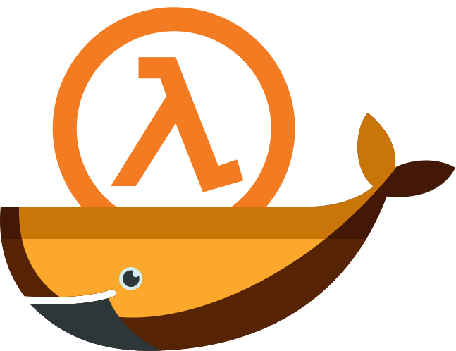

# Configs and Plugins



If you wish to add server configurations, such as add-ons, plugins, map rotations, etc, you can add them to the `config` directory. Your directory setup should look something like the following where you're running either `docker run` or `docker compose` next to where the `config` directory is located.

```
├── 📂 server
│   ├── 📜 docker-compose.yml
│   ├── 📂 config
│   │   ├── 📜 mapcycle.txt
│   │   ├── 📜 motd.txt
│   │   ├── 📂 maps
|   │   |   ├── 📜 crazytank.bsp
```

The `config` directory is volume-mapped within the directory for the game for which you're starting the container. For example, if you're starting a container for `cstrike`, you can add things like `mapcycle.txt` or `motd.txt` here, and it would appear within the corresponding `cstrike` directory within the container.

The config directory should be volume mapped to `/temp/config`, for example `./config:/temp/config`, once the container starts it will re-write the files into the correct place so the Half-Life Dedicated Server client recognizes them.

> [!NOTE]  
> The startup examples posted in the project README already have this directory volume mapped accordingly. If you've strayed from the suggested setup, [please refer back to it to get started](../../README.md).

```
├── 📦 hlds
│   ├── 📂 cstrike
│   │   ├── 📂 maps
|   │   |   ├── 📜 crazytank.bsp
│   │   ├── 📜 mapcycle.txt
│   │   ├── 📜 motd.txt
```

> [!TIP]  
> You can use this method to install server plugins such as AMX Mod, Meta Mod, etc., as the directory can handle nested folders too; for example, these can be placed in `config/addons/amxmodx` etc.

1. Create a folder called `config` alongside where you would typically start the server process. If you've cloned this project locally, you'd place your files alongside this README file. If you're building a custom image, place them alongside the equivalent README in the `container` directory.
1. Add your config files to the directory.
1. Start the image as you usually would, either with `docker run` or `docker compose up`.

For a list of all the available server configuration types, [refer to the Valve Developer Wiki](https://developer.valvesoftware.com/wiki/Main_Page).

## Resources 📚

- [Getting Started and Usage](../README.md)
- [Custom Mods](../mods/README.md)
- [Building a Custom Image](../container/README.md)
- [Contributing](../CONTRIBUTING.md)
